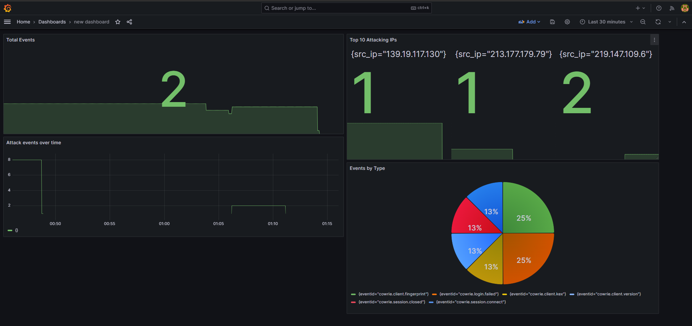

# Cowrie Honeypot SIEM — Real-Time Attack Monitoring

A lightweight, self-hosted SIEM that ingests [Cowrie](https://github.com/cowrie/cowrie) honeypot logs and visualises live attack activity in real time. Built entirely with open-source tools and deployed via Docker Compose on a single Debian VPS.

This project is the monitoring layer for a companion honeypot project, turning raw JSON attack logs into an interactive operational dashboard.

---

## Dashboard Preview



The dashboard provides at-a-glance visibility into:
- **Total events** captured over the selected time range
- **Top attacking IPs** ranked by activity
- **Attack events over time** — temporal view of attack intensity
- **Events by type** — breakdown of the SSH/Telnet attack lifecycle

---

## Architecture
┌─────────────┐     ┌──────────┐     ┌────────┐     ┌──────────┐

│   Cowrie    │────▶│ Promtail │────▶│  Loki  │────▶│ Grafana  │

│  honeypot   │     │ (collect)│     │(store) │     │(visualise)│

│  JSON logs  │     │          │     │        │     │          │

└─────────────┘     └──────────┘     └────────┘     └──────────┘

| Component | Role | Why |
|-----------|------|-----|
| **Promtail** | Collects and parses Cowrie's JSON logs | Lightweight log shipper |
| **Loki** | Stores and indexes log streams | Far lighter than Elasticsearch |
| **Grafana** | Dashboards and visualisation | Industry-standard, open source |

This stack was chosen specifically for **low resource usage** — it runs comfortably alongside the honeypot on a 2 GB VPS, where a traditional ELK stack would not.

---

## Quick Start

### Prerequisites
- Docker and Docker Compose
- A running Cowrie honeypot producing JSON logs

### 1. Clone the repository
```bash
git clone https://github.com/mikemarinesimon-hub/cowrie-siem.git
cd cowrie-siem
```

### 2. Configure credentials


### 3. Adjust the log path (if needed)
In `docker-compose.yml`, ensure the Promtail volume points to your Cowrie log directory:
```yaml
- /home/cowrie/cowrie/var/log/cowrie:/var/log/cowrie:ro
```

### 4. Launch the stack
```bash
docker-compose up -d
```

### 5. Access Grafana
Open `http://YOUR_SERVER_IP:3000` and log in with the credentials from your `.env` file.

---

## Configuration

### Promtail pipeline
Promtail parses each Cowrie JSON event and promotes key fields (`eventid`, `src_ip`) to labels, enabling fast filtering and aggregation in Grafana. See [`promtail/config.yml`](promtail/config.yml).

### Importing the dashboard
The pre-built dashboard is included as JSON in [`grafana/`](grafana/). To import:
1. In Grafana, go to **Dashboards → New → Import**
2. Upload the JSON file
3. Select **Loki** as the data source

---

## Example Queries (LogQL)

**Count all events over the range:**
```logql
sum(count_over_time({job="cowrie"} | json [$__range]))
```

**Top 10 attacking IPs:**
```logql
topk(10, sum by (src_ip) (count_over_time({job="cowrie"} | json | src_ip != "" [$__range])))
```

**Events grouped by type:**
```logql
sum by (eventid) (count_over_time({job="cowrie"} | json [$__range]))
```

**Detecting intrusions outside known IP ranges (allowlist concept):**
```logql
sum(count_over_time({job="cowrie"} | json | src_ip != "" | src_ip !~ "203\\.0\\.113\\..*" [$__range]))
```

---

## Repository Structure
.

├── docker-compose.yml      # Full stack definition

├── promtail/

│   └── config.yml          # Log collection & parsing pipeline

├── grafana/

│   └── dashboard.json       # Pre-built dashboard

├── docs/

│   └── screenshots/         # Dashboard screenshots

├── .env.example            # Environment variable template

└── README.md

## Tools & Technologies

- **Grafana** — visualisation and dashboards
- **Loki** — log aggregation
- **Promtail** — log collection
- **Docker / Docker Compose** — containerised deployment
- **LogQL** — query language

## Notes

This project is for educational and research purposes. Credentials are managed via environment variables and never committed. The `.env` file is excluded from version control.

## Related Project

This SIEM consumes logs from a Cowrie honeypot. See the companion repository for the honeypot deployment and threat intelligence analysis.
